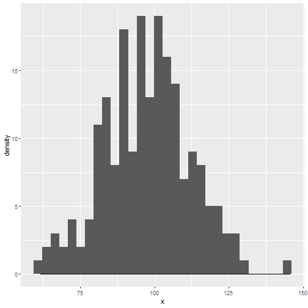

Avaliação Intervalar
========================================================
author: Luiz F. P. Droubi
date: 24/08/2019
autosize: true

Interrvalo de confiança para uma média simples
========================================================

É possível construir um intervalo de confiança ao nível $\alpha$ para uma média simples, da seguinte forma:

$$\hat\mu \pm Z_{\alpha}s.e.(\hat\mu)$$

- $s.e.(\hat\mu)$ é o erro-padrão do estimador


Exemplo
========================================================


```r
x <- rnorm(200, mean = 100, sd = 15)
mean(x)
```

```
[1] 97.62068
```

```r
fit <- lm(x ~ 1)
confint(fit, level = 0.80)
```

```
                10 %    90 %
(Intercept) 96.30146 98.9399
```

Exemplo
========================================================


