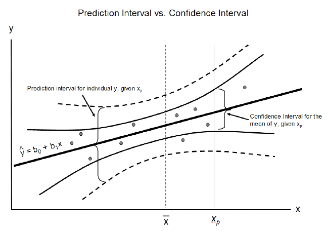
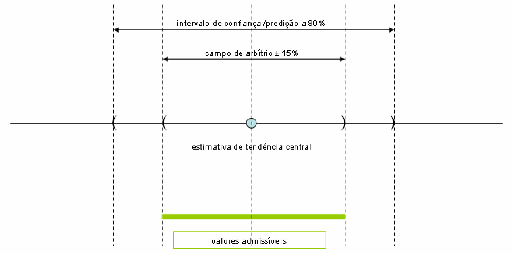
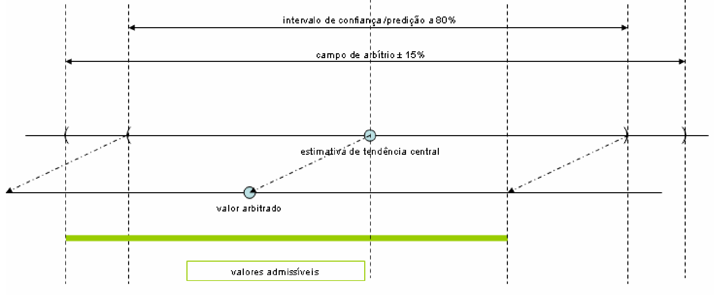
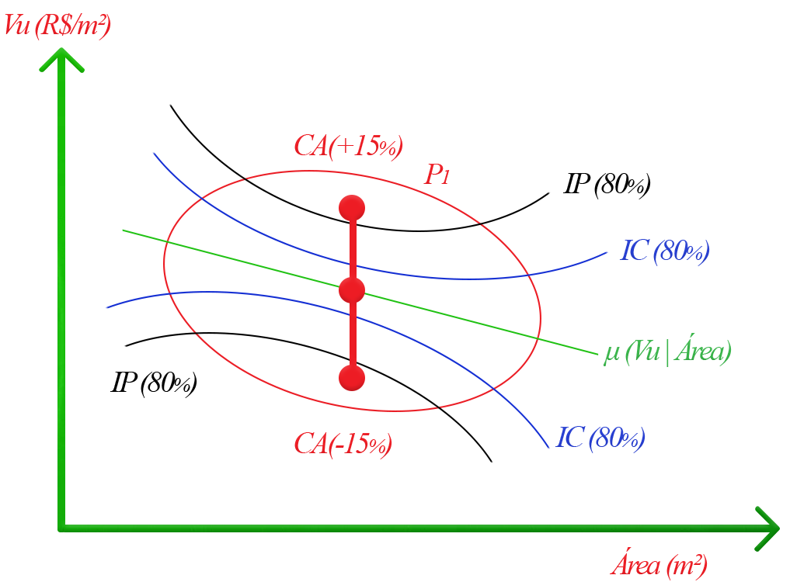
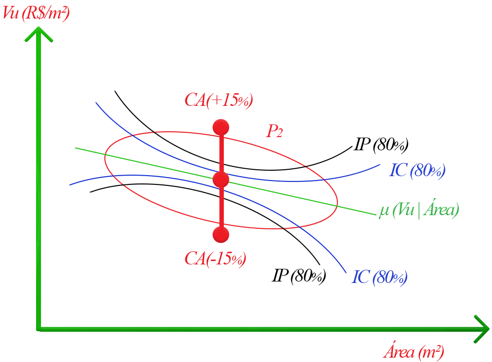
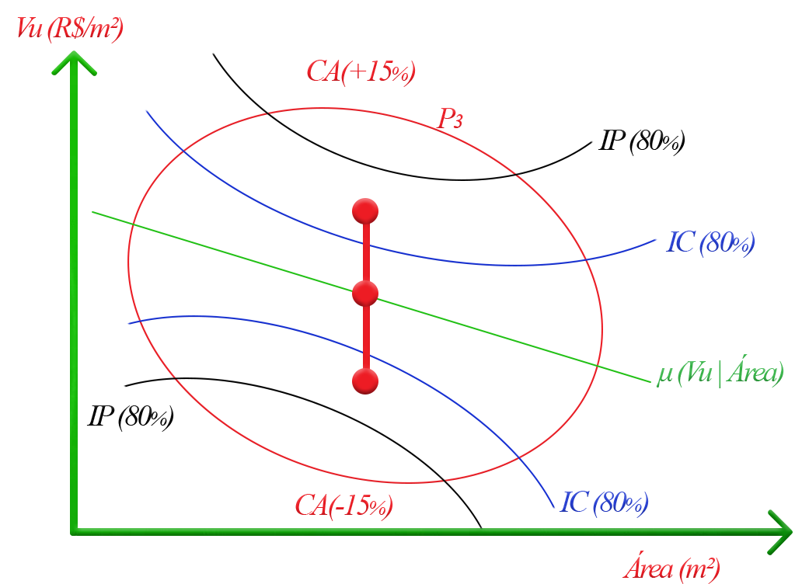

class: title-slide

```{r setup, include=FALSE}
options(htmltools.dir.version = FALSE)
knitr::opts_chunk$set(echo = FALSE, warning = FALSE, message = FALSE,
                      fig.align = "center", out.width = "80%", fig.path = "images/",
                      eval = TRUE)
library(appraiseR)
library(papeR)
library(summarytools)
library(stargazer)
library(knitr)
library(mosaic)
library(ggplot2)
library(ggthemes)
theme_set(theme_bw())
library(cowplot)
```

.pull-left[
]

.pull-right[
<br><br><br><br>
### Crítica à Avaliação Intervalar na NBR 14.653-02

#### Autores:

* Luiz Fernando Palin Droubi
* Carlos Augusto Zilli
* Norberto Hochheim
* Willian Zonatto
]

---
class: primary, center, middle

## Inferência Estatística

---
class: primary

## Inferência Estatística

É o conjunto de técnicas e procedimentos que permitem dar ao pesquisador um **grau
de confiabilidade**, de confiança, nas afirmações que faz para a população, baseadas
nos resultados das amostras.

--
### Média simples

Dada uma variável aleatória $X$ com média $\mu(X)$ e variância $\text{Var}(X) = \sigma^2$ desconhecidas, estimar $\hat \mu(X)$.

É sabido que $\hat \mu(X) = \mathbb{E}(X) = \bar{x} = \frac{1}{n}\sum x_i$.

--

## Qual a precisão de $\hat \mu(x)$?

---
class: primary

## Variância

Pode-se mostrar que a variância da média amostral $\sigma_\bar{x}^2$ é igual à variância populacional $\sigma$ dividida pelo tamanho da amostra $n$, ou seja:

$$\text{Var}(\bar{x}) = \sigma_\bar{x}^2 = \frac{\sigma^2}{n}$$
--

Se a variância populacional $\sigma$ é desconhecida, esta deve ser estimada. Pode-se mostrar que um estimador não-viesado da variância populacional é:

$$s^2 = \frac{1}{n-1}\sum_{i = 1}^n (x_i - \overline x)^2$$
$$\therefore \sigma_\bar{x}^2 = \frac{s^2}{n} \quad ou \quad \sigma_\bar{x} = \frac{s}{\sqrt{n}}$$

$\sigma_\bar{x}$ é conhecido como o erro-padrão do estimador $\bar x$.

---
class: primary

## Intervalo de Confiança

Erro-padrão é uma medida de erro de um estimador. O intervalo de confiança é construído em torno de algumas vezes o erro-padrão deste estimador.

$$IC_{\hat \mu} = \hat \mu \pm Z_\alpha s.e.(\hat \mu)$$
Dependendo do nível de confiança desejado, a amplitude do IC pode ser maior ou menor.

--
### Exemplos

$$IC_{95} \approx \hat \mu \pm 1,96 s.e.(\hat \mu)$$
$$IC_{90} \approx \hat \mu \pm 1,64 s.e.(\hat \mu)$$

$$IC_{80} \approx \hat \mu \pm 1,28 s.e.(\hat \mu)$$
---
class: primary

## Atenção

Se o número de dados da amostra é pequeno, utiliza-se a distribuição t de Student.

Alguns estatísticos aconselham:

* Se $n \leq 30$, utiliza-se a distribuição t de Student
* Se $n > 30$, pode-se assumir a normalidade.

---
class: primary

## Exemplo

```{r xcnorm, fig.height=3.5, dev='png', dpi = 600}
m = 3000
s = 250
xcnorm(.8, mean = m, sd = s, return = 'plot', system = 'gg') %>%
  gf_labs(title = bquote("População com média" ~ mu == .(m) ~ "e" ~ sigma == .(s)),
          x = "VU") 
```

---
class: primary, center, middle

```{r}
set.seed(2)
n1 = 50
n2 = 250
vu1 <- rnorm(n1, mean = m, sd = s)
vu2 <- rnorm(n2, mean = m, sd = s)
w1 <- mean(vu1)
w2 <- mean(vu2)
s1 <- sd(vu1)
s2 <- sd(vu2)
se1 <- s1/sqrt(length(vu1))
se2 <- s2/sqrt(length(vu2))
ci1 <- c(w1 + qt(.10, length(vu1 - 1))*se1, 
         w1 + qt(.90, length(vu1 - 1))*se1
         )
ci2 <- c(w2 + qt(.10, length(vu2 - 1))*se2, 
         w2 + qt(.90, length(vu2 - 1))*se2
         )
cp1 <- c(w1 + qt(.10, length(vu1 - 1))*sqrt(s1^2 + se1^2),
         w1 + qt(.90, length(vu1 - 1))*sqrt(s1^2 + se1^2)
         )
cp2 <- c(w2 + qt(.10, length(vu2 - 1))*sqrt(s2^2 + se2^2),
         w2 + qt(.90, length(vu2 - 1))*sqrt(s2^2 + se2^2)
         )
amplitude1 <- (ci1[2] - ci1[1])/w1
amplitude2 <- (ci2[2] - ci2[1])/w2
```

```{r ci, fig.height=3.5, dev='png', dpi = 600, fig.show='hold'}
p1 <- xcnorm(.8, mean = w1, sd = se1, return = 'plot', system = 'gg') %>%
  gf_labs(title = bquote(hat(mu) == .(round(w1, 0)) ~ "," ~ sigma[bar(x)] == .(round(se1,0))),
          subtitle = bquote(n == .(n1)),
          x = "VU") 
p2 <- xcnorm(.8, mean = w2, sd = se2, return = 'plot', system = 'gg') %>%
  gf_labs(title = bquote(hat(mu) == .(round(w2, 0)) ~ ","  ~ sigma[bar(x)] == .(round(se2,0))),
          subtitle = bquote(n == .(n2)),
          x = "VU")
legend_b <- get_legend(
  p1 + guides())
plot_grid(p1 + theme(legend.position="none"), 
          p2 + theme(legend.position="none"),
          nrow = 1, legend_b, align = 'hv')
```

---
class: primary, center, middle

```{r xcnorm1, fig.height=3.5, dev='png', dpi = 600}
p1 <- xpnorm(ci1, mean = m, sd = s, return = 'plot', system = 'gg') %>%
  gf_labs(title = bquote(mu == .(m) ~ "e" ~ sigma == .(s)),
          subtitle = bquote(n == .(n1)),
          x = "VU")
p2 <- xpnorm(ci2, mean = m, sd = s, return = 'plot', system = 'gg') %>%
  gf_labs(title = bquote(mu == .(m) ~ "e" ~ sigma == .(s)),
          subtitle = bquote(n == .(n2)),
          x = "VU")
plot_grid(p1 + theme(legend.position="bottom", 
                     legend.title = element_text(size=6), 
                     legend.text=element_text(size=6)), 
          p2 + theme(legend.position="bottom",
                     legend.title = element_text(size=6), 
                     legend.text=element_text(size=6)),
          nrow = 1, align = 'hv')
```

---
class: primary

|População| Amostragem  | $\hat{\mu}$ | $\sigma_{\bar{x}}$   | IC             | IP             | $p_{CAinf}$                                              |
|:--------|------------:|-----------:|---------------------:|:--------------:|:--------------:|---------------------------------------------------------:|
| P1      | 50          | `r brf(w1)`| `r brf(s1)`          | [`r brf(ci1)`] | [`r brf(cp1)`] |`r pct(pt((.85*w1-w1)/sqrt(s1^2+se1^2), df=length(vu1)))` |
| P2      | 250         | `r brf(w2)`| `r brf(s2)`          | [`r brf(ci2)`] | [`r brf(cp2)`] |`r pct(pt((.85*w2-w2)/sqrt(s2^2+se2^2), df=length(vu2)))` |


---
class: primary, center, middle

## Regressão Linear


---
class: primary, center, middle


---
class: primary

## Média Condicional

A equação de regressão linear nada mais é do que a estimativa da função média
condicional de $Y|X$.

$$\mathbb{E}(Y|X) = X\beta + \epsilon$$ 

Ou

$$y = \hat \mu(X) = X\beta + \epsilon$$

---
class: primary

## Inferência clássica na regressão linear


Satisfeitas as hipóteses da inferências estatística clássica, *i.e.*, homoscedasticidade, normalidade, etc, temos:

### Estimativa Central

$$\hat y_0 = x_0^T \hat \beta$$
### Erro-padrão

$$se(\hat y_0) = se(x_0^T \hat \beta) = \sqrt{\text{Var}(x_0^T\hat\beta)} =   \sqrt{\hat \sigma^2 x_0^T (X^TX)^{-1}x_0}$$
### Intervalo de Confiança

$$IC = \hat y_0 \pm t_{0, 90, n-k-1} \hat \sigma \sqrt{x_0^T (X^TX)^{-1}x_0}$$
---
class: primary

### Intervalo de Predição

Para o intervalo de predição, adiciona-se à incerteza do estimador, a variância da 
população:

$$IP = \hat y_0 \pm t_{0, 90, n-k-1} \sqrt{\text{Var}(x_0^T\hat\beta + \epsilon)}$$
Se os erros forem independentes, então pode-se concluir que $\text{Var}(x_o^T \hat \beta + \epsilon) = \text{Var}(x_o^T \hat \beta) + \text{Var}(\epsilon)$.

Então:

$$IP = \hat y_0 \pm t_{0, 90, n-k-1} \sqrt{\text{Var}(x_0^T\hat\beta) + \text{Var}( \epsilon)}$$
$$IP = \hat y_0 \pm t_{0, 90, n-k-1} \sqrt{\hat \sigma^2 x_0^T (X^TX)^{-1}x_0 + \hat \sigma^2}$$
$$IP = \hat y_0 \pm t_{0, 90, n-k-1} \hat \sigma \sqrt{x_0^T (X^TX)^{-1}x_0 + 1}$$

---
class: primary, center, middle



---
class: primary, center, middle

## NBR 14.653-02


---
class: primary

### Estimativa de tendência central

Quando for adotada a estimativa de tendência central para a avaliação, o intervalo de valores admissíveis deve estar limitado simultaneamente: 

A) ao intervalo de predição ou ao intervalo de confiança de 80 % para a estimativa de tendência central; 

B) ao campo de arbítrio.

---
class: primary, center, middle



---
class: primary

### Valor arbitrado

Quando for adotado o valor arbitrado, o intervalo de valores admissíveis deve estar limitado simultaneamente: 

A) ao intervalo em torno do valor arbitrado com amplitude igual à do intervalo de predição ou ao intervalo de confiança de 80% para a estimativa de tendência central; 

B) ao campo de arbítrio em torno da estimativa de tendência central.


---
class: primary, center, middle



---
class: primary, middle

## NBR 14.653-02

### Aplicação em diferentes cenários

.center[
```{r image_grobs, fig.show = "hold", out.width = "33%", fig.align = "default"}
# 
# 
# 
knitr::include_graphics(c('Cenario_1.png', 'Cenario_2.png', 'Cenario_3.png'))
# p1 <- ggdraw() + draw_image('Cenario_1.png', scale = .7)
# p2 <- ggdraw() + draw_image('Cenario_2.png', scale = .7)
# p3 <- ggdraw() + draw_image('Cenario_3.png', scale = .7)
# plot_grid(p1, p2, p3, nrow = 1)
```
]

---
background-image: url(CAs.png)
background-size: contain

---
class: primary

## Dados lognormais

```{r}
y_hat <- 13.8155
s <- 0.1003
y_inf <- y_hat - qnorm(.9)*s
y_sup <- y_hat + qnorm(.9)*s
p <- tibble(estimativa = c("Moda", "Mediana", "Media"),
  estimativa_central = c(exp(y_hat - s^2), exp(y_hat), exp(y_hat + s^2/2)),
  ca_inf = .85*estimativa_central,
  ca_sup = 1.15*estimativa_central,
  ip_inf = c(exp(y_inf - s^2), exp(y_inf), exp(y_inf + s^2/2)),
  ip_sup = c(exp(y_sup - s^2), exp(y_sup), exp(y_sup + s^2/2))
  )
t_p <- t(p[, -1])
colnames(t_p) <- p$estimativa
t_p <- as.data.frame(t_p)
kable(t_p, format = "html", digits = 0, row.names = TRUE, 
      format.args = list(big.mark = ".", decimal.mark = ","))
```

***

```{r}
probs <- apply(t_p, 2, plnorm, meanlog = y_hat, sdlog = s)
kable(100*probs, format = 'html', digits = 1, 
      format.args = list(big.mark = ".", decimal.mark = ","))
```

---
class: primary, center, middle

# Obrigado!


